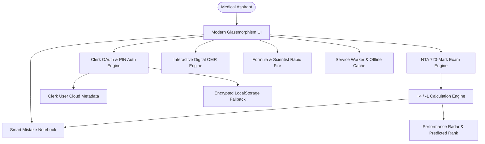

<div align="center">

# 🩺 NEET UG 2028 — Target 720/720 Medical Entrance OS

### *All-in-One Offline-First Medical Entrance Study Suite, NTA Mock Engine & AIIMS Preparation OS*
**Built for Serious NEET UG Aspirants Aiming for AIIMS New Delhi & Top Government Medical Colleges (GMCs)**

<br/>

[](https://developer.mozilla.org/)
[](https://developer.mozilla.org/)
[](https://developer.mozilla.org/)
[](https://clerk.com/)
[](https://web.dev/progressive-web-apps/)
[](https://github.com/VinayKumarMakvana/NEET)

</div>

---

## 📖 Table of Contents

- [🌟 Overview](#-overview)
- [🎯 Core Features](#-core-features)
  - [1. Complete 96 Chapters NCERT Syllabus Breakdown](#1-complete-96-chapters-ncert-syllabus-breakdown)
  - [2. NTA Standard 720-Mark Exam Simulator](#2-nta-standard-720-mark-exam-simulator)
  - [3. Interactive Digital OMR Bubbling Engine](#3-interactive-digital-omr-bubbling-engine)
  - [4. Smart Mistake Notebook & Weak-Area Targeter](#4-smart-mistake-notebook--weak-area-targeter)
  - [5. Physics & Chemistry Formula Rapid Fire Vault](#5-physics--chemistry-formula-rapid-fire-vault)
  - [6. NCERT Scientist Chronology & Milestone Flashcards](#6-ncert-scientist-chronology--milestone-flashcards)
  - [7. Multi-Tier Clerk Cloud OAuth & Offline PIN Security](#7-multi-tier-clerk-cloud-oauth--offline-pin-security)
  - [8. AIIMS Readiness Certificate Generator](#8-aiims-readiness-certificate-generator)
  - [9. Progressive Web App (PWA) Native Mobile Install](#9-progressive-web-app-pwa-native-mobile-install)
- [📊 Syllabus & Subject Weightage Breakdown](#-syllabus--subject-weightage-breakdown)
- [🏗️ System Architecture & Data Flow](#️-system-architecture--data-flow)
- [📁 Project Directory Structure](#-project-directory-structure)
- [🚀 Local Setup & Development](#-local-setup--development)
- [🌐 Vercel Production Deployment](#-vercel-production-deployment)
- [👨‍💻 Author & Acknowledgements](#-author--acknowledgements)

---

## 🌟 Overview

**NEET UG 2028 OS** is a high-performance, distraction-free preparation ecosystem engineered to simulate real National Testing Agency (NTA) examination conditions.

It addresses common hurdles faced by medical aspirants:
1. **Scattered Study Materials**: Replaces multiple apps with a single, consolidated 96-chapter NCERT database.
2. **Exam Anxiety & Time Mismanagement**: Simulates authentic 3 hours 20 minutes countdown pressure with negative marking (`+4 / -1`).
3. **Repeated Silly Mistakes**: Automatically captures every incorrectly answered question into a categorized **Mistake Notebook** for focused revision.
4. **Cross-Device Sync**: Synchronizes study progress, completed MCQs, and test scores between mobile phones, tablets, and desktop computers via **Clerk Cloud Metadata**.

---

## 🎯 Core Features

### 1. Complete 96 Chapters NCERT Syllabus Breakdown
- **Physics, Chemistry, Botany, and Zoology** covering both Class 11 and Class 12.
- Granular subtopic tracking with difficulty rating, high-yield weightage flags (High/Medium/Low), and completion percentages.
- High-definition video lecture links and curated reference textbooks.

---

### 2. NTA Standard 720-Mark Exam Simulator
- Exact NTA NEET exam pattern: **200 Questions (Section A: 35 mandatory + Section B: 15 with 10 to attempt)**.
- **3 Hours 20 Minutes (200 minutes)** live countdown timer with auto-submit.
- Instant score computation: Correct (`+4`), Incorrect (`-1`), Unattempted (`0`).
- Detailed question-by-question explanations, NCERT page references, and subject-wise score split (Physics / Chemistry / Botany / Zoology).

---

### 3. Interactive Digital OMR Bubbling Engine
- Authentic grid of circular bubbles (A, B, C, D) for real-time exam muscle memory.
- Instant question jumping, status markers (Answered, Flagged for Review, Unvisited).
- Prevents double-bubbling and warns when attempting more than 10 questions in Section B.

---

### 4. Smart Mistake Notebook & Weak-Area Targeter
- Automatically logs all negative-marked questions from mock tests into a dedicated revision vault.
- Tagged by error type: **Conceptual Error**, **Calculation Mistake**, **Formula Confusion**, or **Misread Question**.
- Retake tests specifically composed of your historical mistakes to achieve 100% mastery.

---

### 5. Physics & Chemistry Formula Rapid Fire Vault
- Interactive flashcard engine covering all high-frequency formulas in Mechanics, Electrodynamics, Thermodynamics, Physical Chemistry, and Organic Named Reactions.
- Speed-drill mode with keystroke shortcuts (Space / Arrow keys) for rapid revision.

---

### 6. NCERT Scientist Chronology & Milestone Flashcards
- Dedicated module for historical scientists, discoveries, years, and experimental models mentioned in NCERT Biology.

---

### 7. Multi-Tier Clerk Cloud OAuth & Offline PIN Security
- **⚡ Clerk Cloud OAuth**: Seamless 1-click Google / Email OTP authentication.
- **☁️ Cloud Metadata Sync**: Automatically syncs test scores, mistake notebook, and chapter progress to Clerk User Metadata.
- **🎓 Student PIN & Roll Number Mode**: Complete offline functionality when internet connectivity is unavailable.
- **💾 JSON Backup & Restore**: One-click download/upload of full student progress database.

---

### 8. AIIMS Readiness Certificate Generator
- Generates a personalized **AIIMS New Delhi Readiness Certificate** upon achieving milestone scores in full syllabus mock exams.
- Features student name, roll number, percentile ranking, verification hash, and signature stamp.

---

### 9. Progressive Web App (PWA) Native Mobile Install
- Native installation on **Android**, **iOS (Safari Add to Home Screen)**, **Windows PC**, and **macOS**.
- 100% offline-first architecture with service worker caching.

---

## 📊 Syllabus & Subject Weightage Breakdown

| Subject | Class 11 Chapters | Class 12 Chapters | Total Marks |
| :--- | :---: | :---: | :---: |
| ⚛️ **Physics** | Mechanics, Waves, Thermodynamics (15 Ch) | Electrodynamics, Optics, Modern Physics (14 Ch) | **180 Marks** |
| 🧪 **Chemistry** | Physical, Inorganic, General Organic (14 Ch) | Coordination, Organic Reactions, Polymers (16 Ch) | **180 Marks** |
| 🌿 **Botany** | Plant Diversity, Cell Biology, Physiology (11 Ch) | Genetics, Ecology, Reproduction in Plants (11 Ch) | **180 Marks** |
| 🦁 **Zoology** | Animal Kingdom, Human Physiology (11 Ch) | Human Reproduction, Evolution, Biotechnology (11 Ch) | **180 Marks** |
| 🏆 **Total** | **51 Chapters** | **45 Chapters (96 Total)** | **720 Marks** |

---

## 🏗️ System Architecture & Data Flow



---

## 📁 Project Directory Structure

```
NEET-2028/
├── js/
│   ├── auth-clerk.js            # Clerk Cloud OAuth & PIN Security Engine
│   ├── certificate.js           # AIIMS Readiness Certificate Generator
│   ├── flashcards-data.js       # High-Yield Flashcard Database
│   ├── formula-rapid-fire.js    # Speed Formula Drill Engine
│   ├── main.js                  # Main Application Orchestrator
│   ├── mistake-notebook.js      # Auto-Capture Mistake Revision Vault
│   ├── mock-engine.js           # 720-Mark NTA Mock Exam Simulator
│   ├── notes-data.js            # NCERT Summary Notes & Cheat Sheets
│   ├── omr-engine.js            # Digital OMR Bubbling & Marking System
│   ├── pwa-installer.js         # PWA Native Installation Manager
│   ├── questions-data.js        # Curated NCERT Question Bank
│   ├── resources-data.js        # Video Links & Recommended Books
│   ├── scientist-data.js        # NCERT Scientist Chronology
│   ├── syllabus-data.js         # 96 Chapters Granular NCERT Syllabus
│   └── test-tree-engine.js      # Chapter-Wise Diagnostic Test Engine
├── brand-mark.svg               # Vector Brand Mark
├── brand.css                    # Design Tokens & Brand Identity
├── icon.svg                     # High-Res Vector PWA Icon
├── index.html                   # Master Application Viewport
├── local-server.js              # Local Node.js Development Server
├── manifest.webmanifest         # PWA Manifest Configuration
├── package.json                 # Project Metadata & Scripts
├── styles.css                   # Responsive Styling & Dark/Light Themes
├── sw.js                        # Service Worker for Offline Caching
├── vercel.json                  # Vercel Deployment Configuration
└── README.md                    # Detailed Project Documentation
```

---

## 🚀 Local Setup & Development

### 1. Clone the Repository
```bash
git clone https://github.com/VinayKumarMakvana/NEET.git
cd NEET
```

### 2. Run Locally
Since this is a lightweight, zero-dependency static application, you can run it using Node.js:
```bash
node local-server.js
```
Or open `index.html` directly in any modern browser.

---

## 🌐 Vercel Production Deployment

Deploying **NEET UG 2028 OS** to Vercel takes less than a minute:

### 1. Web Dashboard Deployment (Recommended)
1. Go to [vercel.com](https://vercel.com/) and log in with your GitHub account.
2. Click **"Add New..."** ➔ **"Project"**.
3. Import the repository: **`VinayKumarMakvana/NEET`**.
4. Configure Project Settings:
   - **Framework Preset**: `Other`
   - **Root Directory**: `./`
   - **Build Command**: *(Leave empty)*
   - **Output Directory**: `./`
5. Click **"Deploy"**!

### 2. Terminal Deployment (Vercel CLI)
```bash
# Install Vercel CLI
npm install -g vercel

# Deploy project
vercel --prod
```

---

## 👨‍💻 Author & Acknowledgements

* **Lead Developer & Creator**: **Vinay Kumar Makvana**
* **Target Audience**: NEET UG 2026 / 2027 / 2028 Aspirants
* **GitHub Repository**: [https://github.com/VinayKumarMakvana/NEET.git](https://github.com/VinayKumarMakvana/NEET.git)

---

<div align="center">
  <sub>Built with ❤️ for future doctors. Crack NEET UG with 720/720!</sub>
</div>
